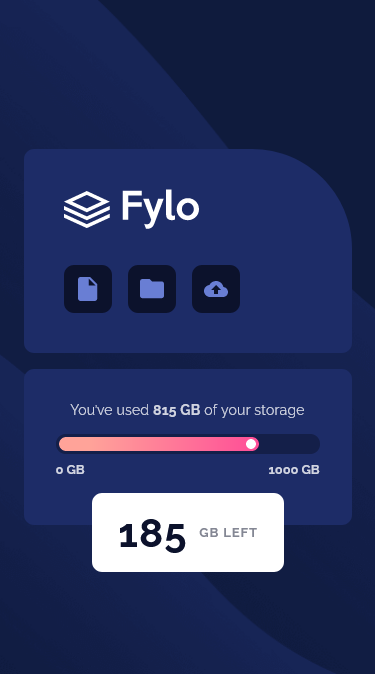
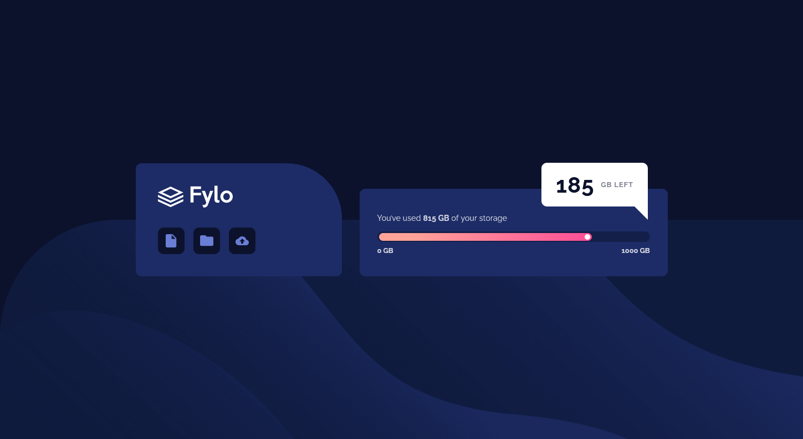

# Frontend Mentor - Fylo data storage component solution

This is a solution to the [Fylo data storage component challenge on Frontend Mentor](https://www.frontendmentor.io/challenges/fylo-data-storage-component-1dZPRbV5n). Frontend Mentor challenges help you improve your coding skills by building realistic projects. 

## Table of contents

- [Overview](#overview)
  - [The challenge](#the-challenge)
  - [Screenshot](#screenshot)
  - [Links](#links)
- [My process](#my-process)
  - [Built with](#built-with)
  - [What I learned](#what-i-learned)
  - [Continued development](#continued-development)
  - [Useful resources](#useful-resources)
- [Author](#author)

## Overview

### The challenge

Users should be able to:

- View the optimal layout for the site depending on their device's screen size

### Screenshot

### Links

[live site URL](https://fylo-data-storage-component-kas.netlify.app/)

## My process

### Built with

- Semantic HTML5 markup
- CSS custom properties
- Flexbox
- Mobile-first workflow

### What I learned

Mobile First Workflow is less buggy, enhances load time and enables you to prioritize content.

### Continued development

### Useful resources

- [Color Pallete](https://webkul.github.io/coolhue/)
- [Less Absolute Positioning With Modern CSS](https://ishadeed.com/article/less-absolute-positioning-modern-css/?s=09)
- 

## Author

- Frontend Mentor - [@roy-eugene049](https://www.frontendmentor.io/profile/roy-eugene049)

